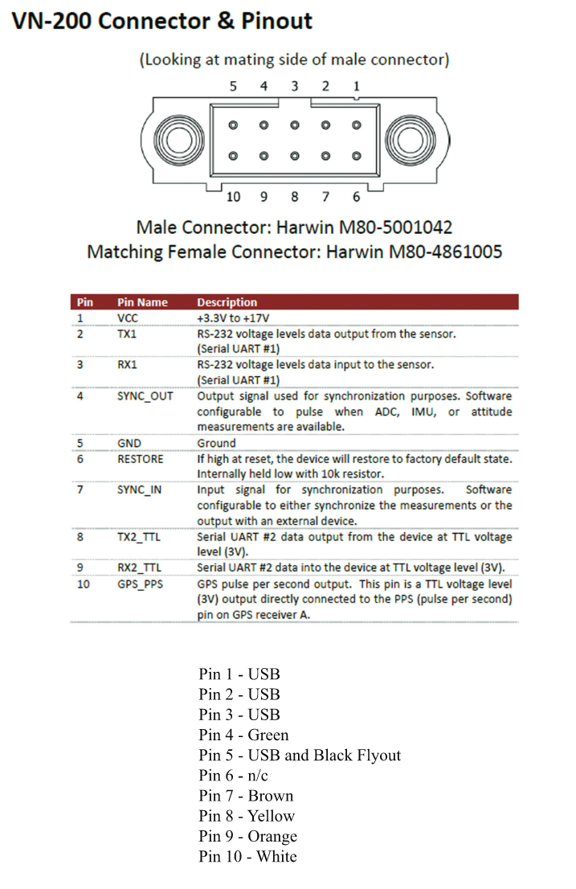
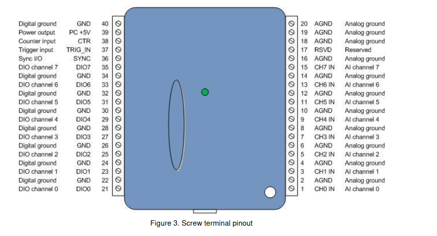

# BC5-C Datalogger Launch Procedure
1. Before placing in the BC5's battery, ensure SYNC_IN (brown) on the VectorNav
is connected to the Sync I/O (1608FS plus, 1808 will be TMR1) port on the DAQ.





2. Also check that the Pi has the following wires connected to it.
    - 5V regulator to microUSB power
    - VectorNav USB cable
    - DAQ USB Cable
    - Button signal (White -> GPIO2) and ground (Black -> GND)
3. Plug in the router
4. Secure and plug in  the battery to the plane.
    - The Pi should automatically connect via WiFi to the router. Alternatively
    you can plug it in via ethernet
5. One the ground station computer (GSU1):
    - Connect to the router's WiFi network (Network name a password is on the
    router)
    - On a browser, go to 192.168.1.1
    - Enter password: 'admin'
    - Navigate to active users on the network
        - For Linksys: 'Local Network' -> 'Client DHCP Table'
    - Record the IP address to the Pi, it is statically assigned and should be:
    192.168.1.142
6. Using Putty (or another SSH program), connect to the Pi by going to
pi@{pi_ip_address}, password: uavlabs2020
7. From here, we will be using a series of Linux commands on the Pi to launch
the datalogger program:
    ```sh
    cd ~/BC5-Datalogger/build
    nano ../rpi3b.yml ; # confirm or change the launch parameters and then
    exit with CTRL-X
    sudo setsid -w ./getData ../rpi3b.yml
     ```
8. Confirm there are no errors on the output of the program. If there are
connection issues, a relaunch usually works.
    - Take note of the run number, these will be associated to your files at the
    end of sampling.
9. You can now exit the SSH session and the program will keep running.
10. If the button_start setting is enabled, you can now press the button to
launch datalogging. WARNING: only press it once and the VN lights and DAQ should
turn on. Pressing it again will stop the sampling.
11. Once you are finished logging, press the button again and the VN and DAQ
should stop blinking. The samples have been taken and written out to files at
output_dir (from the config file rpi3b.yml).
12. Repeat step 6 on the ground station.
13. Do the following Linux commands to convert your raw data files to CSVs:
    ```sh
    cd ~/BC5-datalogger
    sudo ./extract_all.sh {output_dir} {run_number}; # output_dir from rpi3b.yml, run_number from step 8
    cd {output_dir}
    ```
14. From here, copy over the files to whatever media you want them on. WinSCP is
available on the ground station and a flash drive can also be used. Here are
tutorials for both:
    - [WinSCP](https://winscp.net/eng/docs/guide_tunnel#connecting_through_ssh_tunnel)
    - [USB Drive](https://linuxconfig.org/howto-mount-usb-drive-in-linux)
